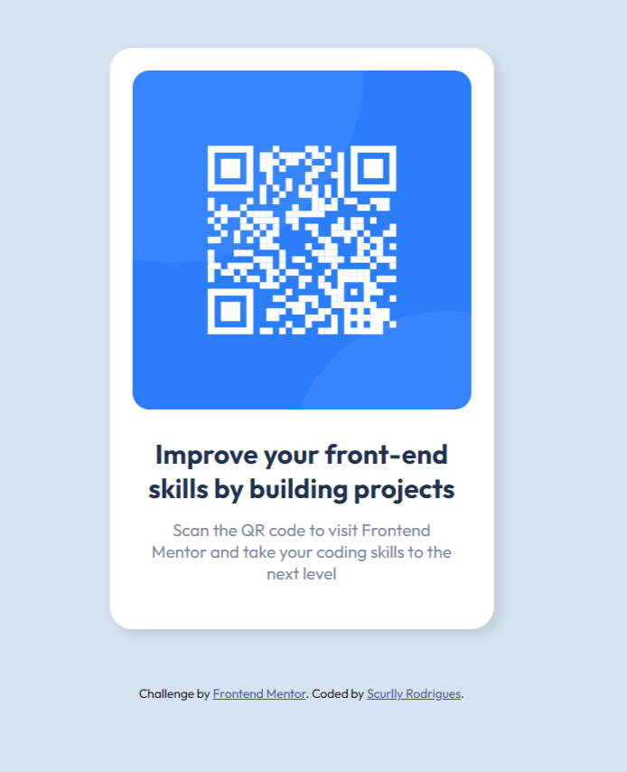

# Frontend Mentor - QR code component solution

This is a solution to the [QR code component challenge on Frontend Mentor](https://www.frontendmentor.io/challenges/qr-code-component-iux_sIO_H).

## Table of contents

- [Overview](#overview)
  - [Screenshot](#screenshot)
  - [Links](#links)
- [My process](#my-process)
  - [Built with](#built-with)
  - [Continued development](#continued-development)
  - [Useful resources](#useful-resources)
- [Author](#author)
- [Acknowledgments](#acknowledgments)

## Overview
The QR Code Component Challenge on Frontend Mentor is a front-end coding challenge aimed at testing one's HTML and CSS skills. The challenge involves creating a responsive and interactive QR code component.

### Screenshot

### Links

- Solution URL: [https://scurlly.github.io/QR-code-component/]

## My process

I began by analyzing the challenge requirements and breaking down the component into smaller parts. Then, I referred to the design png provided for the design.

Next, I started coding the HTML markup for the component, followed by the CSS styling. I made sure to use appropriate classes and selectors to make my code more organized and easier to maintain.

Finally, I tested the component thoroughly on different devices and browsers to ensure it was responsive.

### Built with

- Semantic HTML5 markup
- CSS3

### Continued development

While working on this project, I realized there are still areas where I can improve. In particular, I want to focus on:

Improving my CSS skills, especially with regards to layout and positioning.
Experimenting with different color schemes and designs for the component.

### Useful resources

- https://developer.mozilla.org/en-US/docs/Web/CSS/box-shadow

## Author

- Frontend Mentor - [@scurlly](https://www.frontendmentor.io/profile/scurlly)

## Acknowledgments

I would like to thank Frontend Mentor for providing this challenge and allowing me to practice my front-end skills. Additionally, I would like to thank the creators of the resources mentioned above for helping me learn and improve.

